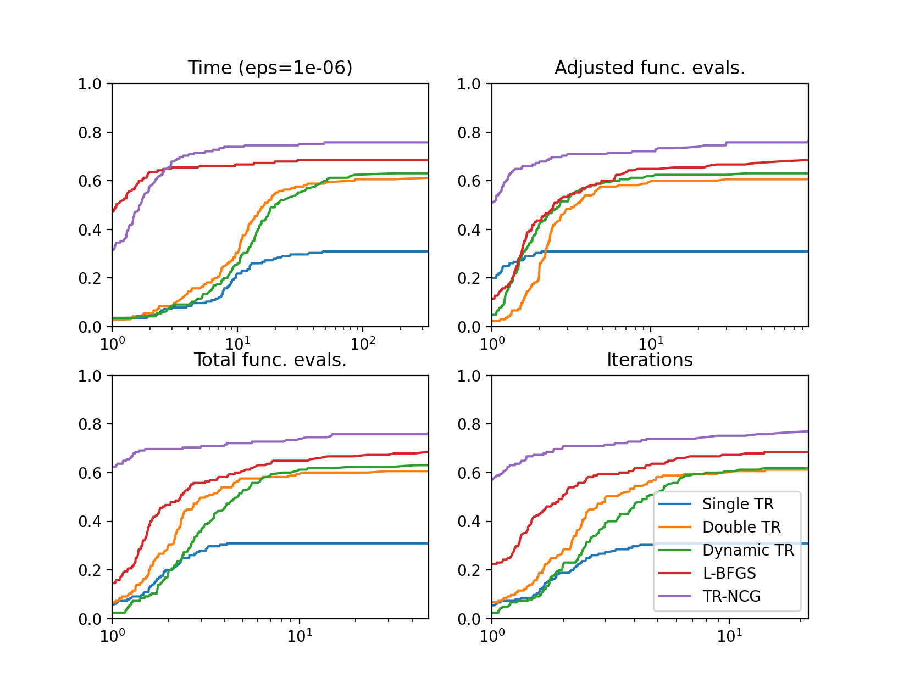

# TROPHY: A dynamic precision trust region solver

TROPHY (**T**rust **R**egion **O**ptimization with **P**recision **H**ierarch**Y**) is, as the name implies, a trust region method that uses differing precision to (hopefully) accelerate time to solve by using lower precision when able and increasing precision when necessary. A central purpose of this summer's work was to employ the algorithm to a real world problem, validating its merit and providing numerical results for publication. 

There were several tasks that needed to be addressed. First, TROPHY had to be rewritten in Python from Julia. Although this might seem strange in light of the popularity and supremacy of Julia, a number of the test problems that interested us were already written in Python. To check that the algorithm was working as expected, we tested it on the CUTEst problem set against both single and double precision. Although the an option for single precision appeared to be available for `PyCUTEst`, the Python port for CUTEst, executables were never generated when using this option. Consequently, the code was amended to run `preducer`, a function written by Jan, to downcast to the appropriate precision before compiling. These files were store seperately in the problem cache.

We decided to use the PyDDA examples as our real world problems. This had a nice benefit of extending Rebecca's (a previous intern) work. She rewrote several terms of the objective function using JAX, an autodifferentiation tool written and maintained by Google. Since JAX is written to take advantage of GPUs, the hope was that we would see a considerable speed-up using single rather than double precision.

Although this may have been true in theory, it turns out that function evaluations for the `plotting_winds`, also known as the Darwin example, are cheap compared to the cost of solving (approximately) the trust region subproblem. As a result, the speed-up is negligible. For a more expensive to evaluate function/gradient pair, the saving should be more apparent. Since the additional work seemed negligible, we started investigating the Hurricane Florence example which has function/gradient evaluation cost that is approximately 20 times longer than the Darwin example. Unfortunately, as we began looking at this problem, we failed to converge which resulted in several days of trying to understand where errors may have arisen. 


# PyCUTEst build and multi-precision problem cache

To work with multi-precision in PyCUTEst, a problem cache must be built in multiple precisions. This was accomplished by tracking down the point in the PyCUTEst code after sources files have been generated via the SIF decoder, but before the source files have been compiled. At this point, `preducer.py` is called which runs a subroutine that casts the problem in single precision then compiles. Although we don't expect any computational speed-ups, function evaluations are carried out in lower precision allowing us to evaluate deterioration of solutions using single rather than double precision. 

To build the multi-precision objectives and gradients for the CUTEst set via PyCUTEst, we do the following:

1. The CUTEst set must be installed first and the environment set up correctly. Installation instructions can be found at the [PyCUTEst site](https://jfowkes.github.io/pycutest/_build/html/install.html) and the other links included. It is necessary to set several environment variables for intance:
    ```sh
    export ARCHDEFS="~/_research/vp_trust/archdefs"
    export SIFDECODE="~/_research/vp_trust/sifdecode"
    export CUTEST="~/_research/vp_trust/cutest"
    ```
    Although the PyCUTEst package will be installed, a modified package will be used to build the different packages and cache them for test use later. The main difference is that the amended package has been modifed to allow for a precision specification, i.e., single or double. 

2. Pull the repo for `preducer`  from [Jan's Github page](https://github.com/jhueckelheim/preducer) which has the following dependencies 
    ```python
    fparser, sys, re, textwrap
    ```
    
3. Change directory to the folder containing Navigate to the folder containing `BuildMultiPrecision.py` and the `pycutest_for_trophy` package then run `python BuildMultiPrecision.py`.

After doing this, the problems should be built without trouble. In the event some of the builds fail, add the problems name to the `bad_problems`  list and build the rest.


# Solving CUTEst problems and comparing

Once all the CUTEst problems have been built, we are able to benchmark performance of TROPHY versus single and double precision alone and other algorithms if we choose. In our early stages, we compared again `f_min_lbfgsb` which is the `scipy` implementation of the bounded BFGS algorithm. Since BFGS is a line search method, the hope was that we'd realize a significant savings by virtue of evaluating each function many fewer times. Since the CUTEst problems are small, this might not be a great benefit, but should illustrate the merit of variable precision and should require fewer evaluations (on an adjusted basis), than only double precision trust region methods. 

To test the problems and generate output, files are generate in the data folder (or where ever specified within `profiler.py` under `use_dir` variable. By running `profiler.py` and setting the appropriate Python path within the scipt to call on appropriate location of files, Python plots with performance metrics are generated.  We have a difficult time beating L-BFGS and the built in scipy trust region solver that uses Newton-CG with a full Hessian. There are a few things worth considering: first, scipy is highly optimized, our method, not so much and second, the built in trust region method is using a full Hessian. Since we generally won't have access to a full Hessian and if we do, won't be able to even form the matrix, the comparison is skewed. Nonetheless, we present the results here. 





# PyDDA as a real world problem 

The `PyDDA` package uses radar data and other components in a physics informed objective to generate wind fields. We chose this problem for several reasons. First, a previous intern had worked on the package to implement the objective in JAX which is a Google written and maintained AD tool that allows for calculations to run on GPUs. This in theory would allow us to accelerate computation and speed convergence. 

To get the package working with TROPHY, there were several adjustments that needed to be made. Modifications were built on top of the PyDDA package that was augmented by Rebecca's with function and gradient calls written in JAX. I have since added an option that determines whether or not the Jax version is on. I did not perform any tests to validate the accuracy of the JAX implementation. We see differences when solving the `huricane_florence` problem but it's not clear where it's from and goes uninvestigated. It appears to converge to a different point then flatten out. Regardless, the hurricane florence example givens us trouble and is a difficult problem to solve in either case. 

Beyond using JAX amended functions, we have augmented the solver to use TROPHY instead of `f_min_lbfgs_b` as was used previously. There is a flag `use_dynTR` that defaults to true. If set to false, the old BFGS algorithm is used. I haven't tested BFGS extensively after making my edits, breaks could ensue for a variety of reasons. I also removed the restarting procedure for the solver. Previously, L-BFGS would restart after 10 iterations. Convergence checks were conducted between restarts. We changed this to run continuosly without restarts; the solver is called once and runs until a stopping criteria is satisfied.

To use multiple precisions, we needed an objective that accepts different precisions and a way to execute in multiple precisions. To do this, I wrote a function in `wind_retrieve.py` called `obj_fun`  with the inputs `z, params, precision, jax_on` with `z` being the winds speed variable, `params` being the problem parameters,  `precision` taking string values of `"half", "single", "double"`, and `jax_on` specifying whether or not to use JAX functions where available. From within `obj_fun`, calls `J_function, grad_J` located in `cost_functions.py`. Both these functions then call on function `change_precision` in `cost_functions.py` that accept variable and parameter then caste them into the desired precision. This is a poor implementations since the parameters are being recast each time. This is certainly worth revisiting in the  future. 

Additional code was added to print more details, iterates and gradients are not stored due to size. Although there was a lot of experimenting, the main package used for testing is `dynTRpydda_edits` which includes all relevant edits (calls to TROPHY, JAX implementation, elimination of restarting loop, etc). Since the main focus was on generating solutions of high accuracy, I didn't spend anytime plotting the results and there is a chance breaks could occur. In addition, I turned off all after the fact smoothing which could also raise issues. 

For our main result using the PyDDA examples, we used three precision levels, half, single, and double and compare the performance to of the same algorithm with a fixed precision level. With the limited numerical range of half precision, it was necessary to warm start to generate an iterate that didn't overflow. We then let each algorithm run until a first order condition was met, in particular until the 2-norm of the gradient fell below 1e-6 (we also generate the same results for 1e-3). Each trust region subproblem is solved to 1e-6 which is slightly looser than earlier runs. After experimentation, we decided to use a memory of 10 curvature pairs since in out performed memory using both 5 and 20 (or maybe 30) pairs. We restart the memory curvature pairs when precision switches over.  The results can be found below. It is worth noting that several some of the results differ based on the precision of subproblem tolerance used. 

### TABLE:  grad 2-norm < 1e-6
| Prec |   # its | Half calls | Sing calls | Doub calls | Adj calls | Fun val | Grad 2-norm | Grad inf-norm | Success? | Time in hrs | Sec per it | Time per half eval | Time per sing eval | Time per doub eval | 
| :---: | :---: | :---: | :---: | :---: | :---: | :---: | :---: | :---: | :---: | :---: | :---: | :---: | :---: | :---: | 
| Single avg  |  8854   | 0  |  8855 |   0  |  4428  |  9.94E-07  |  3.92E-06  |  1.46E-07  |  FALSE    |  4.06  |  1.654  |   n/a  |  0.131  |  n/a |
| Double avg  |  5281  |  0  |  0  |  5283  |  5283   | 1.77E-07  |  9.59E-07  |  5.88E-08  |  TRUE   |    2.41  |  1.647  |  n/a  |  n/a  |  0.151|
| Dyn avg  |  8392.2  |  465 |   7334  |  601  |  4384  |  1.90E-07  |  9.69E-07 |   5.93E-08 |   TRUE    |  3.88 |   1.666  |  0.242462555 |   0.130723396  |  0.156668121 |

We ran the same experiment, but this time stopped at 1e-3 precision. 

### TABLE:  grad 2-norm < 1e-3
| Run  | # its |  Half calls  |  Sing calls  |  Doub calls  |  Adj calls  |  Fun val  |  Grad 2-norm  |  Grad inf-norm  |  Success |
| :---: | :---: | :---: | :---: | :---: | :----: | :---: | :---: | :---: | :---: |
| Single avg   | 3410  |  0   | 3411  |  0   | 1706  |  0.005263138  |  0.000950775  |  3.96E-05 | TRUE  | 
| Double avg  |  1876 |   0   | 0  |  1877 |   1877  |  0.0045012  |  0.00090924  |  3.75E-05 | TRUE   | 
| Dyn avg       | 2362  |  465  |  1898  |  6  |  1071  |  0.004732105  |  0.000942858  |  4.01E-05  | TRUE   | 

In practice, the objective and gradient evaluations were fairly cheap (around 0.15 seconds per evaluation for the `plotting_winds.py` example) making the TR subproblem solve the dominant computational cost. In addition, there seems to be some over-head loading creating `jax.numpy` arrays and casting into different precision such that the savings from single precision over double is limited. Also, the benefit from casting into half precision seems to be entirely missing with half precision or float16 taking twice the time per evaluation. 

When working on the `hurricane_florence` example, the timing was more consistent showing a speed-up of approximately 1.5 times on the GPU and 2 times on CPU (roughly). Unfortunately, convergence didn't occur. Perhaps work can be picked up on this topic later. The table for the compiled tables can be found in the `comparison.xls` file in `trophy/python`. The actual data generated is located on Swing at `/home/rclancy/trophy_data`. 

# Julia CUTEst port

In order to adjust the precision of the different CUTEst problems arbitrarily, without needing to rewrite the solver, I wrote short program `julia_cutest_dtnTR.py` that ports with the functions Prani has been working on. Since the convention hadn't been set yet, we will need to ultimately how we call on the files, but at the moment, this has the machinery to call functions in Julia from Python. 


